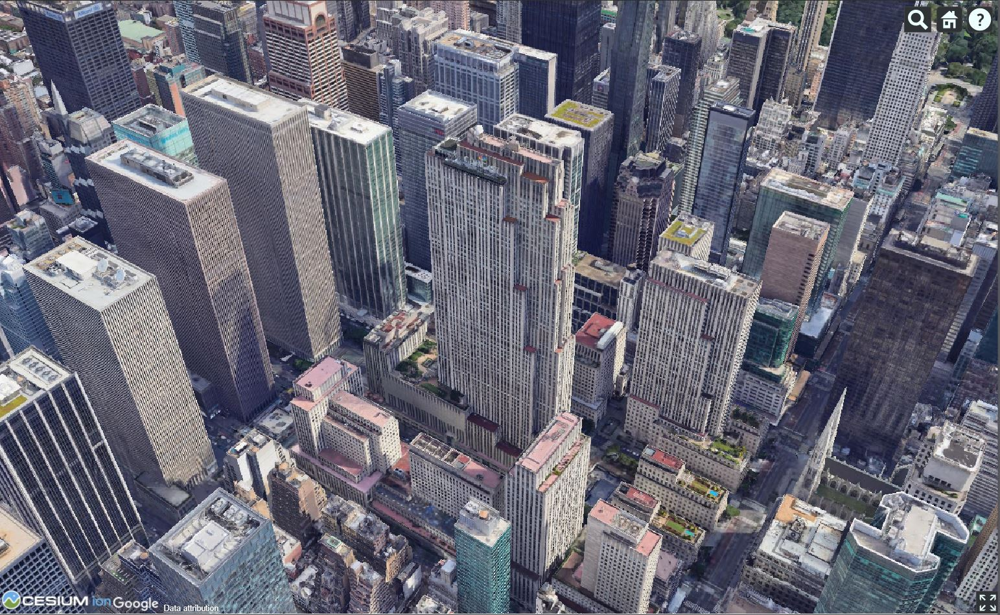
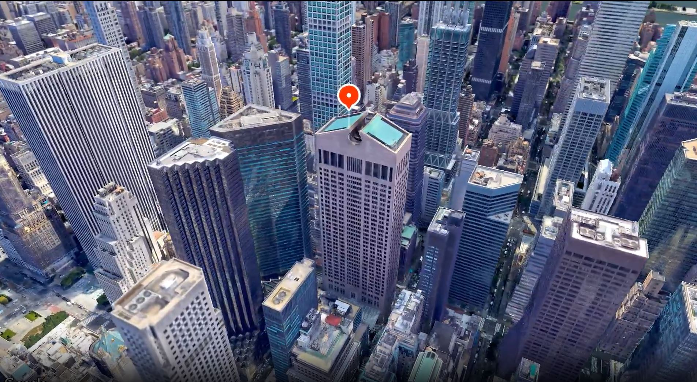
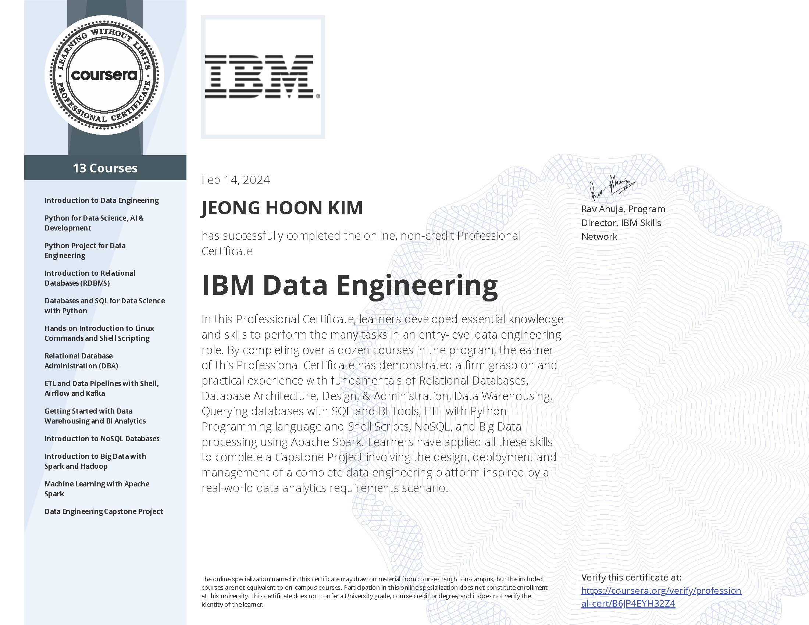

## Work Samples

#### Please click the project title to view the details

---

### Google API

[Photorealistic 3D Tiles](https://github.com/jeonghonkim/Google-API/tree/main/3dTile)

---

[Aerial View](https://github.com/jeonghonkim/Google-API/tree/main/AerialView)

---

### Python Projects 

[Site Audit Automation](/sample_page)

---

[Office Occupancy Recovery Trends in NYC](/pdf/sample_presentation.pdf)

---

### GIS Projects

[Retial Crime in NYC](/sample_page)

---

### Certificates

[IBM Data Engineering](https://github.com/jeonghonkim/IBM_Data_Engineering)

---

---

Page template forked from <a href="https://github.com/evanca/quick-portfolio">evanca</a>

<!-- Remove above link if you don't want to attibute -->
